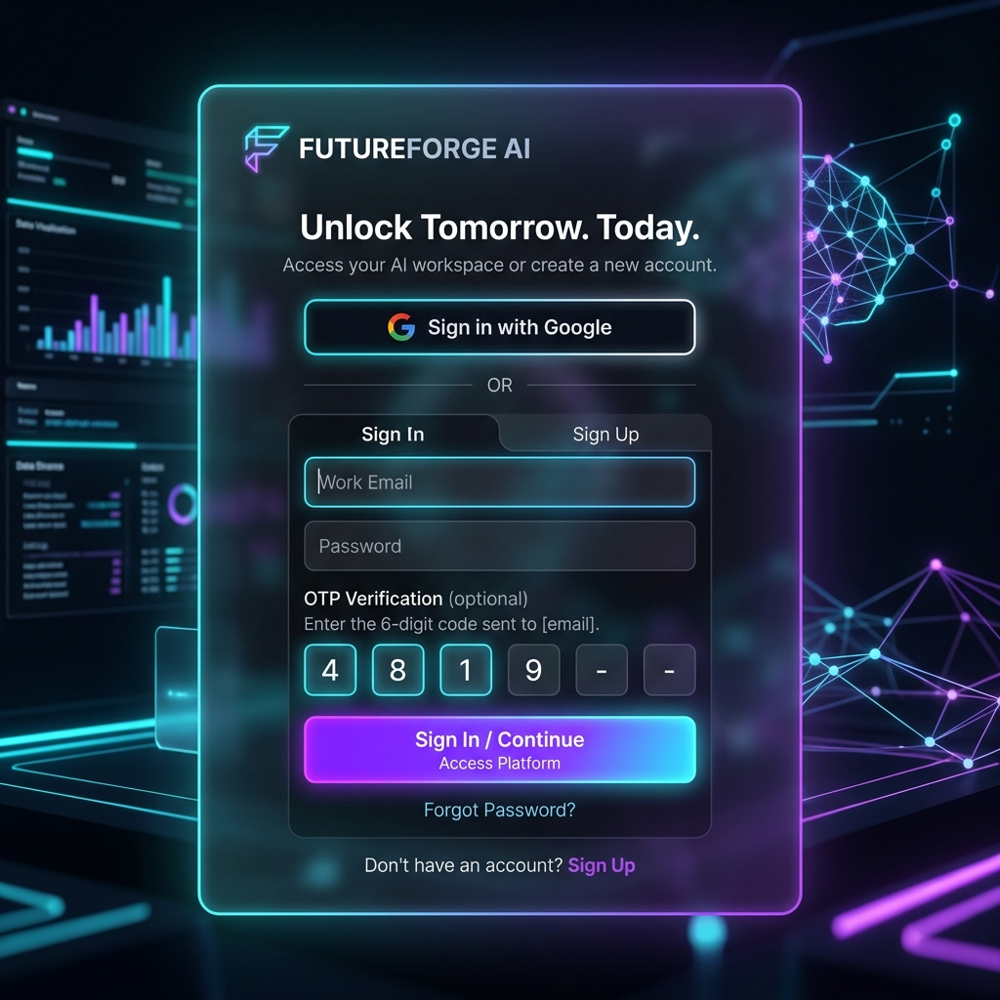
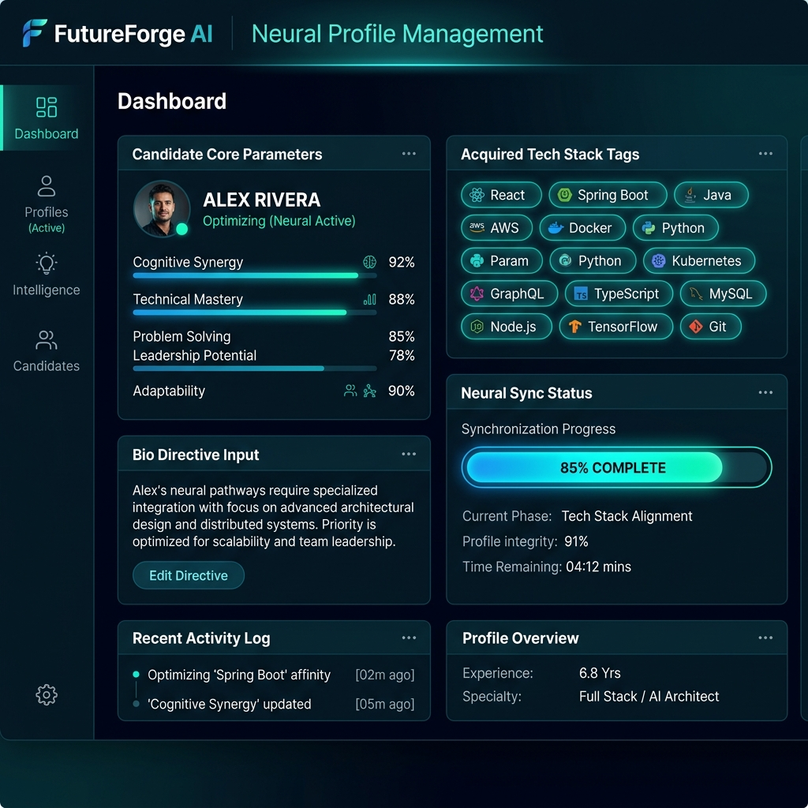
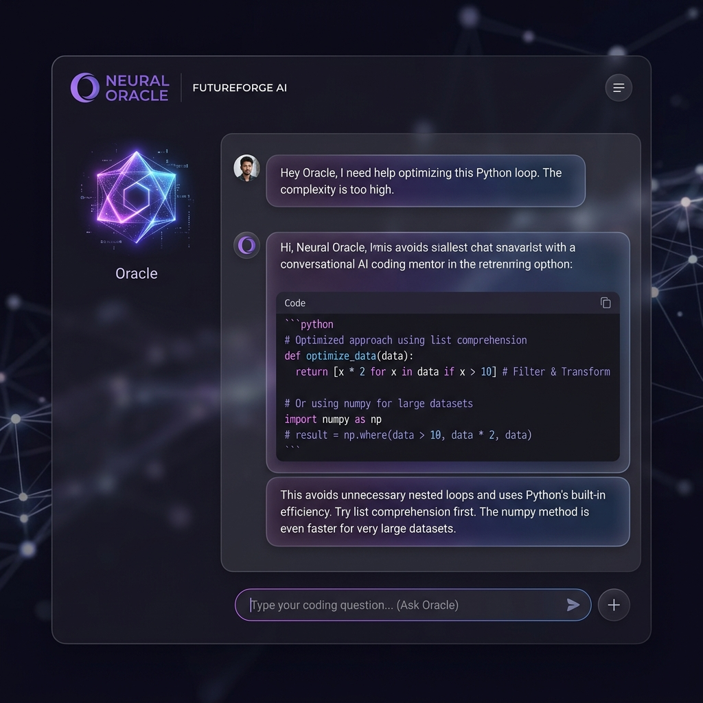
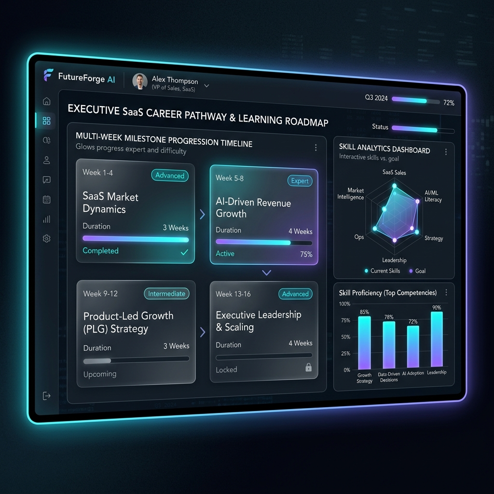
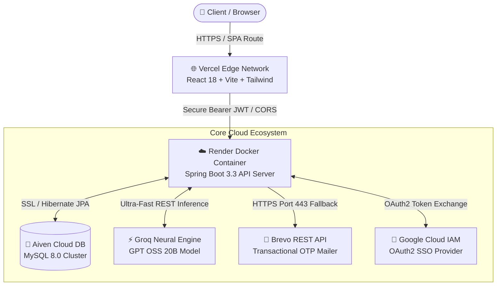

<div align="center">

# 🧠 FutureForge AI — Enterprise Career Intelligence Platform

**An Autonomous SaaS Platform Leveraging LLM Reasoning for Data-Driven Career Trajectories, Dynamic Roadmap Generation, and Real-Time Mentorship**

[](https://futureforge-ai-sage.vercel.app)
[](https://futureforge-ai-s2ha.onrender.com)
[](https://groq.com)

<p>
  
  
  
  
  
  
  
</p>

</div>

---

## 🌟 Executive Project Overview

**FutureForge AI** is a state-of-the-art career progression ecosystem engineered to solve the disconnect between academic curricula and rapidly evolving tech industry demands. By combining deep neural profile analysis with low-latency LLM inference (**Groq Cloud GPT OSS 20B**), the system synthesizes hyper-personalized career roadmaps, evaluates resume PDFs, matches candidates to high-growth tech sectors, and provides continuous conversational guidance.

Designed with enterprise SaaS standards, FutureForge AI features multi-modal authentication (**Google OAuth2 + OTP Verified Email Sign-Up**), dual-delivery transactional emailing, containerized cloud backend orchestration, and responsive glassmorphic frontend engineering.

---

## 📸 Executive Project Showcase Gallery

| 🔐 Multi-Modal Auth & Google SSO | 🧬 Neural Profile Matrix & Resume AI |
| :---: | :---: |
|  |  |
| **Google OAuth2 1-Click SSO & OTP Email Verification** | **AI-Driven Candidate Matrix & PDF Resume Extraction** |

| 💬 Conversational AI Mentor (Oracle) | 🗺️ Dynamic Roadmap & Skills Dashboard |
| :---: | :---: |
|  |  |
| **Low-Latency Coding Mentorship & Code Snippets** | **Multi-Week Learning Curriculums & Analytics** |

---

## 🏛️ System Architecture & Cloud Infrastructure



### ⚡ Technical Subsystems

| Layer | Technologies & Frameworks | Key Capabilities |
| :--- | :--- | :--- |
| **Frontend UI** | **React 18, Vite, TypeScript, Tailwind CSS, Lucide Icons** | Glassmorphism design system, SPA dynamic routing with catch-all CDN fallbacks, reactive state binding. |
| **Backend API** | **Java 17, Spring Boot 3.3, Spring Security, Spring Data JPA** | RESTful architectural patterns, stateless filter chains, HikariCP connection pooling, PDF stream generation. |
| **AI & Inference**| **Groq Cloud API, GPT OSS 20B** | Sub-second deterministic career matrix evaluations, automated PDF resume semantic extraction. |
| **Auth & Security**| **Google OAuth2 SSO, Cryptographic JWT, Brevo HTTP API** | Dual-strategy OTP verification (bypassing cloud SMTP firewalls), BCrypt password hashing, CORS policies. |
| **DevOps & Cloud**| **Docker, Render Web Services, Vercel Edge, Aiven DB** | Multi-stage Dockerfile builds, production profile injection, zero-downtime CI/CD pipelines. |

---

## 💎 Core Capability Suite

### 1. 🤖 Algorithmic Career & Resume Matrix
* **Intelligent PDF Parsing:** Automatically ingests uploaded resume PDFs and extracts core competency nodes, academic tiers, and acquired tech stacks.
* **Predictive Role Recommendations:** Cross-references candidate skill matrices against real-time industry vectors to recommend optimal engineering disciplines.

### 2. 🗺️ Milestone-Based Roadmap Engine
* **Synthesized Learning Paths:** Generates structured, multi-week execution curriculums tailored specifically to the user's target difficulty tier (*Beginner, Intermediate, Advanced*).
* **PDF Executive Report Export:** Utilizes embedded `iText Core` libraries to compile clean, downloadable executive roadmap dossiers on demand.

### 3. 💬 Conversational Neural Oracle
* **Context-Aware Mentorship:** Maintains continuous dialogue state informed by the user's active matrix parameters to deliver targeted debugging, code reviews, and interview prep.

### 4. 🛡️ Enterprise Identity & Verification Engine
* **Frictionless Google SSO:** 1-Click OAuth2 authentication integrated directly with Google Cloud IAM.
* **Failproof OTP Verification:** Features a dual-delivery mailer engine that falls back to HTTP REST APIs over HTTPS (`Port 443`) if cloud provider firewalls block outgoing SMTP (`Port 587`).

---

## 🚀 Live Production Access

The complete application is deployed and running live in production environments:

* 🌐 **Frontend Application:** [https://futureforge-ai-sage.vercel.app](https://futureforge-ai-sage.vercel.app)
* ⚡ **Backend API Service:** [https://futureforge-ai-s2ha.onrender.com](https://futureforge-ai-s2ha.onrender.com)

---

## 💻 Local Development Setup

### Prerequisites
* **Java JDK 17+** & **Apache Maven**
* **Node.js v20+** & **npm**
* **MySQL Server 8.0+**
* API Keys for **Groq Cloud** and **Brevo Mailer**

### 1. Database Initialization
Create a fresh MySQL database instance locally:
```sql
CREATE DATABASE futureforge_db;
```

### 2. Backend API Service
```bash
cd futureforge-ai

# Set required environment variables
export GROQ_API_KEY="your_groq_api_key"
export GOOGLE_CLIENT_ID="your_google_client_id"
export GOOGLE_CLIENT_SECRET="your_google_client_secret"
export BREVO_API_KEY="your_brevo_api_key"

# Compile and launch Spring Boot server
./mvnw clean spring-boot:run -Dspring-boot.run.profiles=local
```
*The API server will boot up on `http://localhost:8080`.*

### 3. Frontend Client Application
```bash
cd futureforge-ui

# Install dependencies
npm install

# Launch Vite development server
npm run dev
```
*Access the local interface at `http://localhost:5173`.*

---

## 🔒 Security Best Practices & Engineering Highlights

1. **Stateless Session Management:** Zero server-side session memory storage; all identity claims are cryptographically signed within 256-bit JWT access & refresh tokens.
2. **Cloud Firewall Immune Delivery:** Custom HTTP wrapper guarantees high transactional email deliverability across strict cloud container networks.
3. **Optimized Container Footprint:** Lightweight multi-stage Docker builds ensure rapid cold starts and minimal RAM utilization on cloud instances.

---

<div align="center">
  <p>Engineered & Architected by <strong>Manish Kumar</strong></p>
  <p>⭐ Star this repository if you find the architecture or career intelligence models helpful!</p>
</div>
